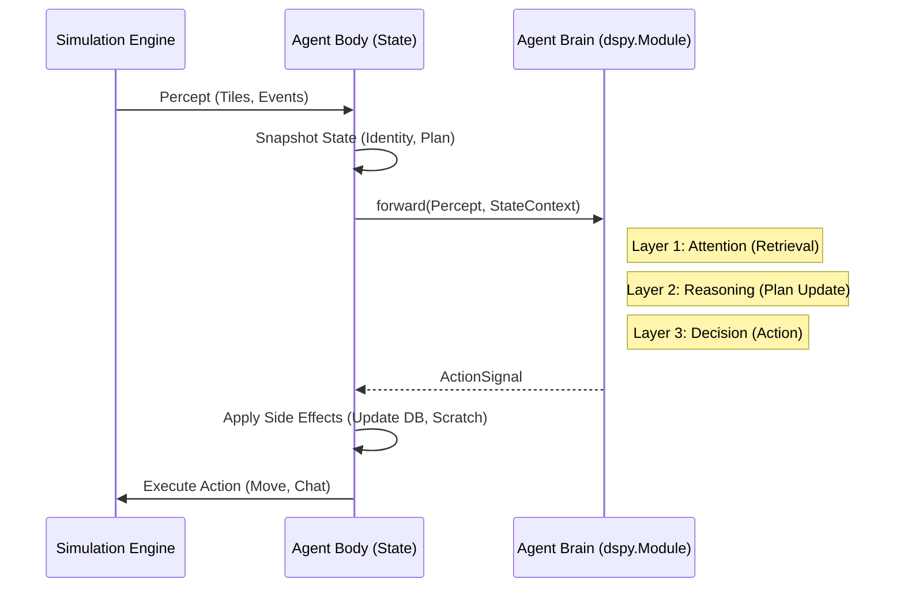
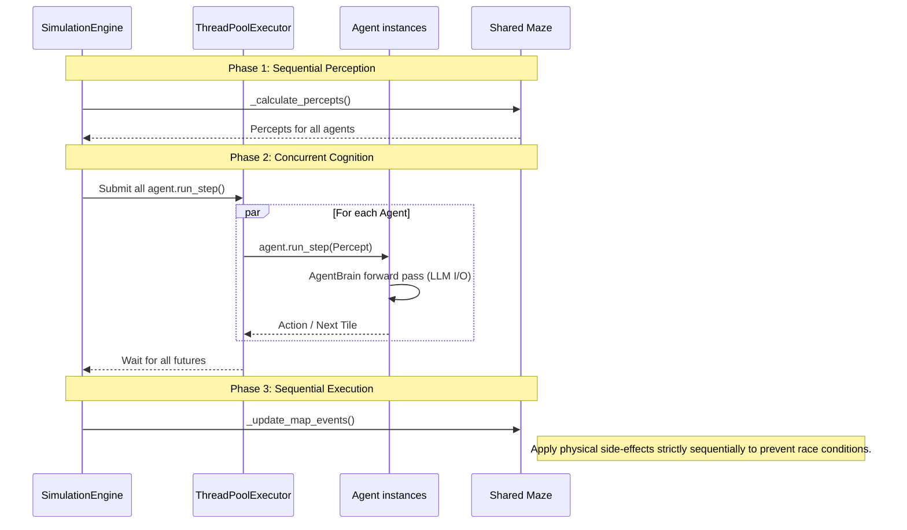

# Agent Architecture: The Neural Approach

This document outlines the architectural paradigm for Generative Agents, shifting from a component-based object-oriented model to a **functional, neural-symbolic model** using DSPy.

## Core Philosophy

### 1. The Agent is a Neural Network
Just as a standard Neural Network (NN) has layers, weights, and a forward pass, our Agent is a `dspy.Module`.
*   **Weights**: The natural language prompts and few-shot examples in our DSPy signatures.
*   **Layers**: Cognitive steps (Retrieval -> Reasoning -> Planning -> Action).
*   **Forward Pass**: Data flows from Input to Output. **No side effects** occur during the forward pass.

### 2. Functional Purity (The "Black Box")
The `AgentBrain` is a pure function:
$$ Action = Brain(State, Percept) $$

*   **Input**: 
    *   **Percept**: What the agent senses *now* (Visuals, Messages).
    *   **State**: A snapshot of the agent's memory and internal status (Identity, Current Plan, Location).
*   **Output**:
    *   **ActionSignal**: Instructions on how to change the world or internal state (Move, Speak, Write to Memory).

### 3. Separation of Concerns
| Responsibility | Component | Description |
| :--- | :--- | :--- |
| **Logic & Reasoning** | `AgentBrain` (DSPy) | Determines *what* to do. Stateless. Optimizable. |
| **State Management** | `Agent` (Python Class) | Holds the "Weights" (Memory/DB). Executes the `ActionSignal`. |
| **World Simulation** | `SimulationEngine` | The physics/game loop that feeds `Percepts`. |

## Detailed Data Flow



## Execution Model: Parallel Cognitive Steps

To prevent the `SimulationEngine` from blocking during synchronous DSPy/Ollama networks requests, the step execution is parallelized using Python's `concurrent.futures.ThreadPoolExecutor`. 

This guarantees that all LLM reasoning happens concurrently, shrinking the simulation step time from `O(N * LLM_Response_Time)` to `O(Max_LLM_Response_Time)`.

### Simulation Engine Sequence



## Module Structure

We separate the Agent into two distinct systems: "Fast" (Acting) and "Slow" (Learning/Reflecting).

### 1. The Agent Brain (System 1: Fast)
*   **File**: `src/generative_agents/agents/brain.py`
*   **Responsibility**: Immediate interaction, pathfinding, dialogue.
*   **Input**: Percept + Current State. 
*   **Output**: ActionSignal.

```python
class AgentBrain(dspy.Module):
    def __init__(self):
        self.perception = SensoryProcessing() # Filter percepts
        self.memory = AssociativeMemoryLayer()        # Retrieve relevant context
        self.planner = PlanningLayer()                # Update daily plan if needed
        self.actor = ActorLayer()                     # Decide immediate action (Move/Chat)
```

### 2. Unified Memory System (The Connectome)
*   **File**: `src/generative_agents/agents/memory/system.py`
*   **Concept**: Combines Vector Search (Associative) + Knowledge Graph (Relations).
*   **Interface**:
    *   `add(event)`: Embeds text AND links nodes.
    *   `retrieve(query)`: Semantic search.
    *   `traverse(node, relation)`: Graph walk.

### 3. Working Memory (Short-Term)
*   **File**: `src/generative_agents/agents/memory/working.py`
*   **Responsibility**: Holds volatile state (Current Action, Attention, Beliefs).
*   **Identity**: Stored here as a stable belief, updated by System 2.

### 4. World Model (Spatial)
*   **File**: `src/generative_agents/agents/memory/spatial.py`
*   **Responsibility**: Internal map of the environment (Tiles, Areas).

### 5. Agent Integration
*   The `Agent` holds a `self.memory` instance (The System).
*   The `AgentBrain` requests context from `self.memory`.

### 6. The Memory Optimizer (System 2: Slow / Reflection)
*   **File**: `src/generative_agents/agents/layers/reflection.py` (Refactored)
*   **Responsibility**: Compressing memory, generating higher-level insights, "Dreaming".
*   **Trigger**: Runs after the Brain, or essentially "offline" when the agent is idle/sleeping.
*   **Input**: Recent Memory Stream.
*   **Output**: New "Thought" Memories (which become input for the Brain later).

## Benefits
1.  **Optimization**: We can use DSPy Optimizers (`BootstrapFewShot`, `MIPRO`) to optimize the entire `AgentBrain` against a metric (e.g., "Did the agent complete its daily goal?").
2.  **Debuggability**: The "trace" of the forward pass shows exactly why a decision was made.
3.  **Testability**: The Brain can be unit-tested with static inputs, ensuring regression safety without spinning up the whole simulation.
